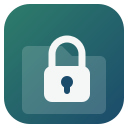

# Enkripta

Enkripta cifra carpetas y archivos en Linux Mint (Cinnamon/Nemo) con AES-256, y lo hace sentir parte del propio sistema: doble clic en el escritorio, botón derecho en Nemo, icono propio para los archivos cifrados. Todo se instala con un único script, sin dependencias raras y sin tocar nada fuera de tu carpeta personal (no hace falta `sudo`).

> 🇪🇸 Este proyecto y esta documentación están, por ahora, solo en español. Si hay interés real por parte de la comunidad, se preparará una versión en inglés (ver [Roadmap](#roadmap)).


## Instalación por terminal o descargar ZIP

```bash
git clone https://github.com/filonux/Enkripta.git
cd enkripta
chmod +x script/enkripta-instalador.sh
./script/enkripta-instalador.sh
```

Eso instala en tu carpeta personal (`~/.local/...`):

- El programa, en `~/.local/bin/enkripta.sh`.
- Su icono.
- Un acceso directo en el **menú de aplicaciones** (abre el asistente gráfico).
- Un acceso directo en el **escritorio**, listo para doble clic.
- El tipo `.cvault` como extensión propia, con Enkripta como programa predeterminado al abrirla.
- Dos acciones en el **botón derecho de Nemo**: `🔒 Cifrar con Enkripta` y `🔓 Abrir vault Enkripta`.

### Desinstalar

```bash
./script/enkripta-instalador.sh --desinstalar
```

Esto quita los accesos, el menú, la asociación `.cvault` y las acciones de Nemo. El script `~/.local/bin/enkripta.sh` no se borra automáticamente (por si lo usas también desde terminal); el propio comando te avisa de dónde está si quieres borrarlo a mano.

### Requisitos

Para instalar y usar Enkripta: `gpg`, `tar`, `gzip`, `shred`, `base64` y `realpath`. Todos vienen de serie en Linux Mint. Opcional pero recomendado: `zenity` (los diálogos gráficos) y `notify-send` (avisos de escritorio). Si te falta `zenity`, el instalador te avisa y te da el comando exacto para instalarlo.

## Uso

### Desde el escritorio o Nemo

- Clic derecho sobre cualquier archivo o carpeta → **🔒 Cifrar con Enkripta**.
- Doble clic sobre un `.cvault` → se abre un menú: descifrar, cambiar contraseña, añadir contraseña o eliminar contraseña.
- Icono en el menú de aplicaciones → abre un asistente que pregunta qué quieres hacer (cifrar un archivo, una carpeta, o abrir un vault existente).

### Desde la terminal

Si añades `~/.local/bin` a tu `PATH` (el instalador te avisa si no lo está), puedes usar:

| Comando | Qué hace |
|---|---|
| `enkripta.sh cifrar <ruta>` | Cifra un archivo o carpeta y crea el `.cvault` |
| `enkripta.sh cifrar_facil <ruta>` | Detecta solo si hay que cifrar o abrir el vault |
| `enkripta.sh <vault.cvault>` | Abre el menú del vault (descifrar / gestionar contraseñas) |
| `enkripta.sh descifrar <vault.cvault>` | Descifra un vault |
| `enkripta.sh actualizar <ruta>` | Vuelve a cifrar el contenido con las mismas contraseñas |
| `enkripta.sh cambiar-contrasena <vault.cvault>` | Sustituye una contraseña existente |
| `enkripta.sh anadir-contrasena <vault.cvault>` | Añade una contraseña alternativa |
| `enkripta.sh eliminar-contrasena <vault.cvault>` | Quita una contraseña (si hay más de una) |
| `enkripta.sh --version` | Muestra la versión instalada |

Todos estos comandos tienen también su alias en inglés (`encrypt`, `decrypt`, `update`, `change-password`, `add-password`, `remove-password`...), por si prefieres escribir así. Y si prefieres los diálogos gráficos desde la terminal, están las variantes `gui`, `gui-encrypt <ruta>` y `gui-menu <vault.cvault>`, que son justo las que usan internamente el menú de aplicaciones, el escritorio y Nemo.

## Contraseñas independientes por vault

La mayoría de herramientas de "cifrar con contraseña" atan los datos a una única contraseña: si quieres compartir el acceso con alguien más, o cambiarla, tienes que volver a cifrarlo todo desde cero.

Enkripta funciona distinto, de forma parecida a los *keyslots* de LUKS: los datos se cifran una sola vez con una clave maestra aleatoria, y esa clave maestra se guarda cifrada por separado para cada contraseña que añadas. El resultado:

- Puedes tener varias contraseñas válidas para el mismo vault (por ejemplo, la tuya y la de otra persona), y cualquiera de ellas lo desbloquea.
- Añadir, cambiar o eliminar una contraseña es una operación pequeña y rápida: **no vuelve a cifrar el contenido**, solo la clave envuelta en ese hueco.
- Puedes quitarle el acceso a alguien (eliminando su contraseña) sin tocar el resto ni volver a subir/mover el archivo cifrado entero.

## Seguridad

- Cifrado simétrico **AES-256** vía GPG.
- Derivación de clave reforzada: `S2K` modo 3, más de 65 millones de iteraciones, `SHA-512`.
- Cada `.cvault` valida su propio contenido antes de descifrar (rechaza archivos manipulados o con nombres internos sospechosos).
- Al cifrar, se te ofrece borrar el original de forma segura con `shred` (varias pasadas), si lo quieres.

## Compatibilidad

Enkripta está pensado y probado para **Linux Mint 22.3 con Cinnamon** (gestor de archivos Nemo), que es de donde vienen las acciones de botón derecho, el icono de escritorio y la asociación de `.cvault`. Debería funcionar igual en cualquier otra versión de Mint o distribución basada en Cinnamon, ya que solo usa carpetas estándar de tu usuario (`~/.local/share/applications`, `~/.local/share/mime`, `~/.local/share/nemo/actions`, etc.).

En otros entornos de escritorio (GNOME, KDE, XFCE...) el instalador seguirá funcionando y `enkripta.sh` seguirá cifrando y descifrando sin problema desde la terminal, pero las acciones de Nemo no aparecerán (al no ser Nemo el gestor de archivos) y tendrás que asociar `.cvault` manualmente si quieres el doble clic.

## Roadmap

- [ ] Versión en inglés del programa y de esta documentación, si hay suficiente interés.
- [ ] Explorar soporte para otros gestores de archivos (Nautilus, Dolphin) si hay demanda.
- [ ] Paquete `.deb` para instalar con un doble clic, sin pasar por `git clone`
      
## Licencia

Enkripta es software libre distribuido bajo los términos de la **GNU General Public License versión 3 (GPLv3)**. Consulta el archivo [LICENSE](LICENSE) para el texto completo.

---

Hecho por **[Filonux](https://github.com/filonux)**.
